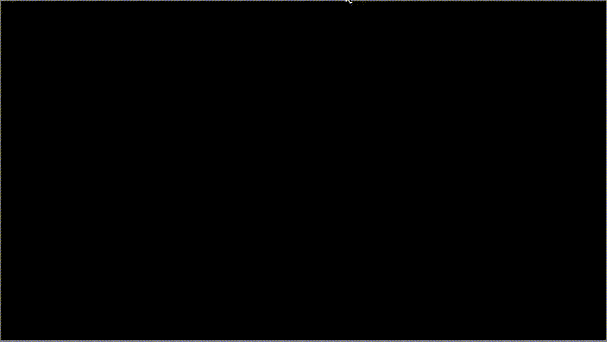

--------------------------------------------------------------------------------

The NetHack Learning Environment (NLE) is a Reinforcement Learning environment
based on [NetHack 3.6.6](https://github.com/NetHack/NetHack/tree/NetHack-3.6.6_PostRelease). 
NLE is designed to provide a standard RL interface to the game, and comes with
tasks that function as a first step to evaluate agents on this new environment.

NetHack is one of the oldest and arguably most impactful videogames in history,
as well as being one of the hardest roguelikes currently being played by humans.
It is procedurally generated, rich in entities and dynamics, and overall an
extremely challing environment for current state-of-the-art RL agents, while
being much cheaper to run compared to other challenging testbeds. Through NLE,
we wish to establish NetHack as one of the next challenges for research in
decision making and machine learning.

You can read more about NetHack on the [NetHack
wiki](https://nethackwiki.com/wiki/Main_Page), and about the version we are
targeting in [README.nh](./README.nh).




## NetHack Gym Environment

Starting with NLE environments is extremely simple, provided one is familiar
with other gym environments:

```python
>>> import gym
>>> import nle
>>> env = gym.make("NetHackScore-v0")
>>> env.reset()    # each reset generates a new dungeon
>>> env.step('1')  # move agent '@' north
>>> env.render()
```


## Installation

NLE requires `python>=3.7`, `libzmq`, and `flatbuffers` to be installed and
available to the system. The easiest way of getting them is to use Conda:

```bash
$ git clone git@github.com:fairinternal/nethack
$ conda create -n nle python=3.7
$ conda activate nle
$ conda install zeromq flatbuffers
$ pip install . -vv
$ pip install -e .
```

On **MacOS**, one can use `Homebrew` as follows:

``` bash
$ brew install flatbuffers zeromq
$ sudo wget https://raw.githubusercontent.com/zeromq/cppzmq/v4.3.0/zmq.hpp -P \
     /usr/local/include
```

On plain **Ubuntu 18.04** `flatbuffers` can be installed by doing:

```bash
# zmq, python, and build deps
$ sudo apt-get install -y build-essential autoconf libtool pkg-config \
    python3-dev python3-pip python3-numpy git cmake libncurses5-dev \
    libzmq3-dev flex bison
# building flatbuffers
$ git clone https://github.com/google/flatbuffers.git
$ cd flatbuffers
$ cmake -G "Unix Makefiles"
$ make
$ sudo make install
```

If you want to extend / develop NLE, please also setup the system as follows:

``` bash
$ pip install ".[dev]"
$ pre-commit install
```


## Trying it out

NLE comes with a few scripts that allow to get some environment rollouts, and
play with the action space:

```bash
$ python -m nle.scripts.play
$ python -m nle.scripts.random_agent
$ python -m nle.scripts.play_random_games
```

Additionally, a [TorchBeast](https://github.com/facebookresearch/torchbeast)
agent is bundled in `nle.agent` together with a simple model to provide a
starting point for experiments:

``` bash
$ pip install ".[agent]"
$ python -m nle.agent.agent
```

Plot the mean return over the last 100 episodes:
```bash
$ python -m nle.scripts.plot --ascii
```
```

  60 +----------------------------------------------------------------------+
     |                                    *                                 |
     |                                   ****                               |
  50 |                                   *  *                               |
     |                                   *  ***                             |
     |                                   *    ** ***                        |
  40 |                                   *     * * *                        |
     |                               *****     *** **                     **|
     |                               *          *    **        *       *****|
  30 |                              **                 *       *       *    |
     |                           ****                  *      **********    |
     |                           ***                    *  *****      **    |
  20 |         ****        ***   *                      ***                 |
     |         *   *     **  *   *                                          |
     |         *   ****  *   *****                                          |
  10 |         *      ****                                                  |
     |        *                                                             |
     |        *                                                             |
   0 |       **                                                             |
     |       *                                                              |
     |     **                                                               |
 -10 +----------------------------------------------------------------------+
     0      10000    20000    30000    40000   50000    60000    70000    80000
```


## Related Environments
- [gym\_nethack](http://campbelljc.com/research/gym_nethack/)
- [rogueinabox](https://github.com/rogueinabox/rogueinabox)
- [rogue-gym](https://github.com/kngwyu/rogue-gym)
- [MiniGrid](https://github.com/maximecb/gym-minigrid)
- [CoinRun](https://github.com/openai/coinrun)
- [Project Malmo](https://www.microsoft.com/en-us/research/project/project-malmo/)
- [OpenAI Procgen Benchmark](https://openai.com/blog/procgen-benchmark/)
- [Obstacle Tower](https://github.com/Unity-Technologies/obstacle-tower-env)


## Citation
```
@inproceedings{kuettler2020nethack,
  title={{The NetHack Learning Environment}},
  author={Heinrich K\"{u}ttler and Nantas Nardelli and Roberta Raileanu and Marco Selvatici and Edward Grefenstette and Tim Rockt\"{a}schel},
  year={2020},
  booktitle={Workshop on Beyond Tabula Rasa in Reinforcement Learning (BeTR-RL)},
  url={https://github.com/facebookresearch/nle},
}
```
